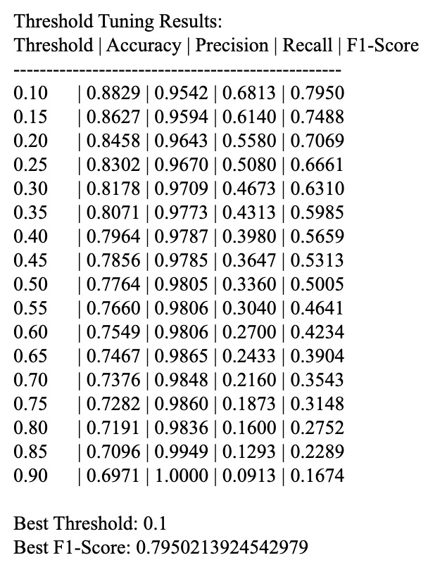

# Model Evaluation
To test the model, we used the following dataset:
1. **Cogito Car Crash Datasets:** This dataset contains 3000 normal driving videos and 1500 crash accident videos.
### 1. Test Set Preprocessing
Please refer to ```TestSet-Setup.py``` for detailed codes. You could download the complete test dataset [here](https://www.dropbox.com/scl/fi/ln9tg7ecwvwinj6mfsm3x/Test_Video.zip?rlkey=rhrldur2ppq2hwkg8bzxb519d&st=414d3xry&dl=0). Here is a walkthrough of what's done in ```TestSet-Setup```:
- After decompress ```Test_Video```, you will see two folders:
	- ```Normal-002``` which contains normal driving videos
	- ```Crash-1500``` which contains car crash videos
- The code combined and scanned all videos (```.mp4``` format) from both folders and for each video:
	- Created a corresponding folder insider new directory ```Test_Video_Frames/```
 	- Extract frames from each video at **10 FPS** using **ffmpeg**
  - Frames were saved with a six-digit name (```000001.jpg```, ```000002.jpg```, etc.)
- For every extracted video, the function assigned a **label**:
	- ```0``` for **normal** driving
 	- ```1``` for **crash** videos
- After labeling, the function shuffled the rows and saved it as ```csv``` file for later training

### 2. Test Set Running
Please refer to ```Test-Model.py``` for detailed codes. If you want to skip test set preprocessing and jump directly with ready-to-go extracted video frames, you could download [here](https://www.dropbox.com/scl/fi/d481fblvypz3lb3eujdz0/Test_Video_Frames.zip?rlkey=1x3k8cw1mx0gcdqekb9n6nj0x&st=1po8wwu6&dl=0). The labels are prepared in ```test_labels.csv```. Here is a walkthrough of what's done in ```Test-Model```:
- Please make sure the functions ```ResNetFeatureExtractor``` and ```VideoClassifier``` are imported from the training code (```ResNet_LSTM_Model2.py```)
- **Define Test Dataset Class** (same as the process in training code)
- **Load Test Set into DataLoader**
- **Load Best Model**
	- Please make sure the saved best model (```best_model.pth```) is in the same folder as ```Test-Model.py```. If not, you could update the directory based on the path to your best model
 	- Both the **feature extractor (```ResNet```)** and the **```BiLSTM``` classifier** are put into ```eval()``` mode
- **Make Predictions**
- **Threshold Tuning**
	- The default test thresholds implemented in the code is from **0.1 to 0.9** (step 0.05), this helps to find the best decision boundary for the test set.
 	- For each threshold, we calculate: **Accuracy**, **Precision**, **Recall**, **F1-score**
  - The **best threshold** is chosen based on **highest F1-score**
  - An example output would look like:<br><br>
<br>
 
### 3. Setup Instructions
To run ```TestSet_Setup.py```, you need to install the following libraries:
```
os
random
pandas
```
To run ```Test-Model.py```, you need to install the following libraries:
```
os
json
pandas
torch
PIL
torchvision
tqdm
sklearn
subprocess
glob
random
numpy
```
