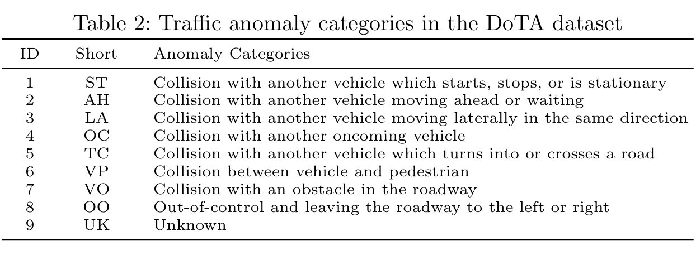

# Preprocess Steps
### DoTA Dataset
The DoTA dataset contains frames of each original video and label file. The [DoTA GitHub](https://github.com/MoonBlvd/Detection-of-Traffic-Anomaly/tree/master) also provides a video-to-frame Python script that can transfer a video to frame. In addition, it also contains a Python script to extract anomaly frames from original videos (The anomaly frames are listed in ```DoTA_annotations.zip``` under "dataset" folder). Please see the ```video2frames.py``` under "dataset" folder for further reference. Following the steps of official DoTA website, after unzipping the dataset, the ```video2frames.py``` script extracts annotated frames for each video clip and writes to ```PATH_TO_SAVE_FRAMES```. Besides the per-video '.json' files, the code also provide a ```metadata_train.json``` and a ```metadata_val.json``` which contains the video metadata in the following format (see the corresponding json files under "dataset" folder):<br>
```
video_id: {
    "video_start": int,
    "video_end": int,
    "anomaly_start": int,
    "anomaly_end": int,
    "anomaly_class": str,
    "num_frames": int,
    "subset": "train" or "test"
}
```
DoTA dataset contain 9 classes of car accidents including:<br><br>
<br>
For this assignment, we are only interested in collisions between two cars, so for ```Preprocess_DoTA```, we filter out class 6-9 using keywords. In addition, in the DoTA dataset, each car-to-car collision is labeled not only by type (e.g., ```lateral```, ```oncoming```) but also by perspective–either ```ego``` or ```other```. The ```ego``` tag indicates that the vehicle equipped with the dashcam is **directly involved** in the collision, while ```other``` means the dashcam-equipped vehicle is a **bystander witnessing** another vehicle’s crash. Since our ultimate goal is a **binary classification**, we do not distinguish between ```ego``` and ```other``` perspectives. Therefore, we consolidate these labels by removing the ```ego``` and ```other``` tag before each remaining ```anomaly_class```.<br>
The updated metadata json files are named ```metadata_train_preprocessed.json``` and ```metadata_val_preprocessed.json``` under "dataset" folder as long as the updated training/validation splitting txt files.<br>
To run ```Preprocess_DoTA``` file, you will need to install the following packages: ```json```, ```os```, ```collections```. You may also want to update the file paths to wherever your metadata json files are.
<br>
### BDD100K Dataset
The BDD100K dataset contains 1000 normal driving video footages. For ```Preprocess_BDD100K```, the data was split to **7:3** for **train:validation**. In addition, we referenced to the existing ```video2frames.py``` to transform each video to frames with ```fps=10```. The processed video was then labeled according to DoTA dataset with the following format:<br>
```
video_id: {
    "video_start": 0,
    "video_end": num_frame - 1,
    "anomaly_start": None,
    "anomaly_end": None,
    "anomaly_class": "normal",
    "num_frames": int,
    "subset": "train" or "test"
}
```
The metadata files for BDD100K dataset are saved also under "dataset" folder with the name ```metadata_train_bdd.json``` and ```metadata_val_bdd.json```, so as the train/val split files. Then, we merged the metadata files of DoTA dataset and BDD100K dataset and the newly updated final version of the metadata files are named ```metadata_train_merged.json``` and ```metadata_val_merged.json```, so as the train/val split files.<br>
To run ```Preprocess_BDD100K``` file, you will need to install the following packages: ```kagglehub```, ```os```, ```json```, ```random```, ```glob```, ```subprocess```. Also, please make sure you have at least **20G** for the kaggle dataset. Finally, you might want to update the ```SOURCE_VIDEO_DIR```, ```OUTPUT_FRAMES_DIR```, and ```METADATA_OUTPUT_DIR``` based on your file organization.


